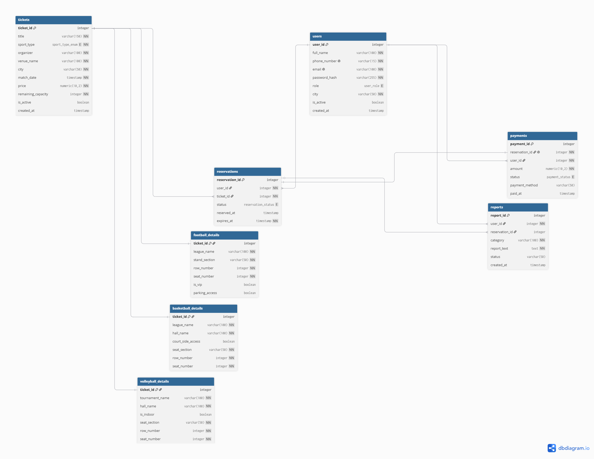

<h1 align="center">📊 Phase 1 Technical Report: Database Architecture & ERD Design</h1>

<p align="center">
  <strong>Project Title:</strong> Sports Ticket Booking & Reservation Platform <br>
  <strong>Selected Database Engine:</strong> PostgreSQL 16+ <br>
  <strong>Encoding:</strong> UTF-8 (Bilingual Support: Persian & English)
</p>

---

## 📖 1. Overview & Architecture Goals

The primary objective of Phase 1 is to design a normalized, robust, and highly scalable relational database structure (3NF) tailored for an Iranian sports ticket booking system. The architecture eliminates data redundancy, enforces strict domain integrity, and optimizes execution speed for search-heavy workloads using advanced indexing strategies.

---

## 🗺️ 2. Entity-Relationship Diagram (ERD) & DBML

The database schema was initially drafted using DBML (Database Markup Language) and visualized using Draw.io. The logical design completely separates generalized ticket data from sport-specific details.

<p align="center">
  
</p>

> **Note:** The original ERD source code (`erd_source.dbml`) and scalable vector versions (`erd_diagram.drawio.pdf`) are available in the `/erd/` directory.

---

## 🏛️ 3. Core Entities & Key Relationships

The database consists of **8 interconnected tables**, structurally separated to maintain high cohesion:

1. **`users`**: Stores user authentication profiles, demographics, soft-delete statuses (`is_active`), and role-based access (`audience` vs. `support`).
2. **`tickets`**: Base entity holding common match metadata (sport type, organizer, date, capacity, and price).
3. **`football_details`, `volleyball_details`, `basketball_details`**: 1-to-1 extension tables storing sport-specific attributes (e.g., VIP access, indoor/outdoor features, stand sections) without polluting the base ticket table with `NULL` columns.
4. **`reservations`**: Manages temporary and permanent ticket reservations (1-to-N from Users and Tickets).
5. **`payments`**: Captures transaction history linked 1-to-1 with reservations.
6. **`reports`**: Allows users to log issues or complaints directly for support staff review.

---

## ⚖️ 4. Normalization (3NF) Justification

All tables conform strictly to Third Normal Form (3NF) standards:

- **No Partial Dependencies:** Every non-key attribute fully depends on the primary key.
- **No Transitive Dependencies:** Attributes specific to a single sport (e.g., stadium roof type or court-side seating) were decomposed into distinct specialized tables (`football_details`, etc.), preventing redundant `NULL` fields in general ticket records.

---

## 🛡️ 5. Integrity Constraints & Business Logic

The schema enforces business logic directly at the database layer using PostgreSQL's advanced constraints:

- **Check Constraints:** Enforces non-negative ticket pricing (`CHECK (price >= 0)`) and valid available seats (`CHECK (remaining_capacity >= 0)`).
- **Temporal Logic (Dates):** Ensures expiration timestamps strictly succeed reservation creation (`CONSTRAINT check_reservation_dates CHECK (reserved_at < expires_at)`).
- **Custom ENUMs:** Prevents invalid string entries by using restricted types (`user_role`, `reservation_status`, `payment_status`, `sport_type_enum`).
- **Uniqueness & Cascading:** Guarantees unique user phone numbers/emails and utilizes `ON DELETE CASCADE / SET NULL` for seamless relational cleanups.

---

## 🚀 6. Advanced Indexing Strategy for High Performance

To fulfill the platform's core requirement of fast searching and filtering, we implemented dual indexing strategies:

1. **B-Tree Indexes (Exact Matches & Sorting):**
   - `idx_tickets_sport_city`: Optimizes filtered queries on sport type and location.
   - `idx_tickets_match_date`: Accelerates chronological sorting for upcoming matches.
   - `idx_reservations_user_status`: Improves lookup speeds for active user reservations.

2. **GIN & Trigram Indexes (Fuzzy Text Search):** _(Bonus Implementation)_
   - Utilizing the `pg_trgm` extension to enable lightning-fast `ILIKE` wildcard searches.
   - `idx_tickets_venue_trgm`: Optimizes searching across venue names.
   - `idx_tickets_title_trgm`: Accelerates keyword lookups in ticket titles.

---

## 🌍 7. Bilingual Seed Data & Encoding (DML)

The `init.sql` script is populated with rich, realistic, bilingual data (Persian and English).
All character limits and encodings are validated to fully support UTF-8, ensuring queries like `SELECT * FROM search_tickets_by_keyword('آزادی');` execute flawlessly alongside English keyword searches.

---

## 🔬 8. Deployment & Testing Guide (Bash / CLI)

To verify the integrity of the schema, run the 23 analytical queries, and test the 8 PL/pgSQL procedures, follow these steps in **Git Bash** or Linux terminal.

### Step 1: Set UTF-8 Encoding (For Windows Git Bash users)

To ensure Persian characters are passed correctly to PostgreSQL:

```bash
export PGCLIENTENCODING=UTF8
```

Step 2: Execute Database Scripts in Order
Run the following commands, replacing postgres with your database user if different:

Bash

# 1. Create Schema & Tables (DDL)

psql -U postgres -d sports_ticket_db -f database/scripts/schema.sql

# 2. Insert Bilingual Seed Data (DML)

psql -U postgres -d sports_ticket_db -f database/scripts/init.sql

# 3. Load PL/pgSQL Functions & Procedures

psql -U postgres -d sports_ticket_db -f database/scripts/procedures.sql

# 4. Run 23 Analytical Queries (Includes UPDATE/DELETE tests)

psql -U postgres -d sports_ticket_db -f database/scripts/queries.sql
Step 3: Test Interactive Search Functions
You can test the implemented Trigram text search functionality using winpty (if on Windows) to prevent terminal freezing:

Bash

# Test English Keyword Search

winpty psql -U postgres -d sports_ticket_db -c "SELECT \* FROM search_tickets_by_keyword('Azadi');"

# Test Persian Keyword Search

winpty psql -U postgres -d sports_ticket_db -c "SELECT \* FROM search_tickets_by_keyword('آزادی');"
